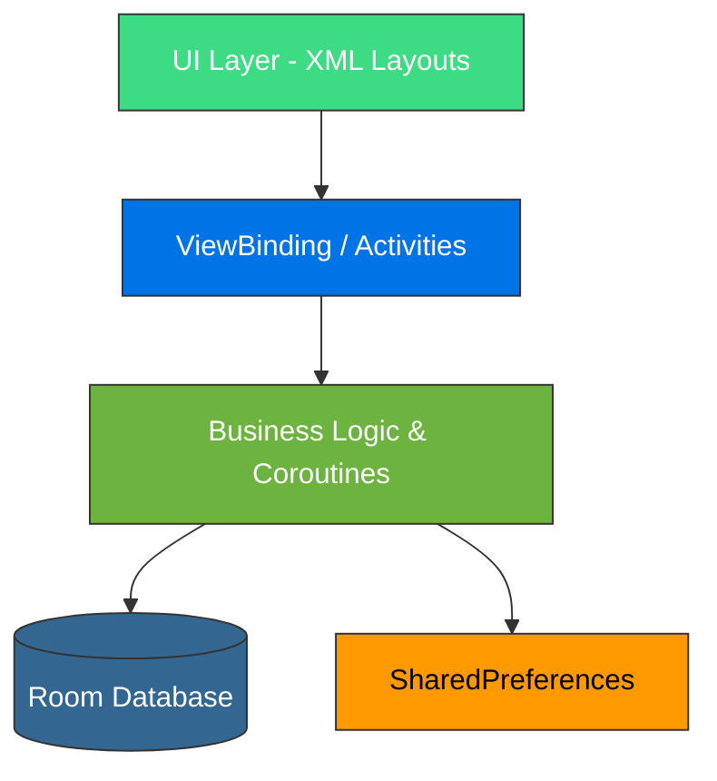

# 🌱 SimaGrow – Sistema de Gestión de Incidencias

**SimaGrow** es una aplicación móvil nativa diseñada para centralizar la gestión de incidencias, usuarios, cursos y actividades. El proyecto se enfoca en ofrecer una experiencia de usuario fluida y un sistema de persistencia robusto, garantizando la integridad de los datos en entornos de gestión educativa o corporativa.

## 🎯 Propósito del Proyecto

El objetivo de SimaGrow fue construir una herramienta de gestión interna que destaque por su eficiencia técnica y facilidad de uso. Se puso especial énfasis en el manejo de datos locales y el ciclo de vida de la aplicación.

* **Arquitectura de Datos:** Implementación de un esquema relacional local complejo mediante Room.
* **Seguridad de Sesión:** Gestión de credenciales y estados de usuario persistentes.
* **Estándar Visual:** Adopción de las guías de Material Design para una interfaz moderna y coherente.

## 📐 Arquitectura del Sistema

He implementado una arquitectura de capas estructurada para separar la interfaz de usuario (diseñada íntegramente en **XML**) de la lógica de negocio y persistencia, utilizando los componentes oficiales de **Android Jetpack**.

## 💻 Implementación Técnica

### 🛠️ Capa de Persistencia (Data Layer)
* **Room Database:** Implementación de una base de datos relacional local sobre SQLite para la gestión de entidades (Usuarios, Incidencias, Cursos y Actividades) con integridad referencial.
* **Kotlin Coroutines:** Gestión de la concurrencia mediante programación asíncrona, asegurando que las operaciones pesadas de base de datos se ejecuten fuera del hilo principal (Main Thread).
* **SharedPreferences:** Uso de almacenamiento clave-valor para la persistencia de la sesión del usuario y flags de estado de la aplicación.

### 🎨 Interfaz de Usuario (UI Layer)
* **Material Design Components:** Adopción de estándares modernos de Google para componentes como *Cards*, *Floating Action Buttons* y *Input Layouts*, garantizando una UX intuitiva.
* **ViewBinding:** Sustitución de `findViewById` por vinculación de vistas para mejorar la seguridad del código, evitando errores de punteros nulos (`NullPointerException`) y optimizando el rendimiento.
* **Navegación Estructurada:** Control de flujos condicionales para el acceso seguro a la aplicación mediante validaciones en tiempo real en los formularios de Login y Registro.

## 🛠️ Stack Tecnológico

| Categoría | Herramientas / Tecnologías |
|-----------|-----------------------------|
| **Lenguaje** | Kotlin |
| **Persistencia** | Room (SQLite), SharedPreferences |
| **Asincronía** | Kotlin Coroutines |
| **UI Framework** | Material Design 3, XML |
| **Arquitectura** | Layered Architecture (Capa de datos y UI) |
| **Herramientas** | Android Studio, ViewBinding |

## 📸 Galería de la Aplicación

A continuación se muestran capturas reales de la interfaz de usuario, destacando el flujo de navegación y el diseño basado en Material Design.

<table align="center">
  <tr>
    <td valign="top" align="center">
       
      Login  
       
      Registro
    </td>
    <td valign="top" align="center">
       
      Home  
       
      Lista de incidencias
    </td>
    <td valign="top" align="center">
       
      Mensajes al profesorado  
       
      Perfil del alumno
    </td>
  </tr>
  <tr>
    <td valign="top" align="center">
       
      Mensajes a soporte
    </td>
    <td valign="top" align="center">
       
      Información de la App
    </td>
    <td valign="top" align="center">
       
      Clean Navigation Flow
    </td>
  </tr>
</table>

---

## 👤 Contacto

  

  

